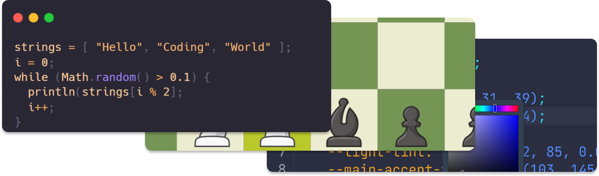

<h1 align="center">Hi, I'm Zev Godfrey</h1>

I'm a 16 year old developer living in Victoria BC. I've been programming primarily in Java since early 2020 but I also have smaller projects in a variety of languages and frameworks. Lately I've been learning web technologies while developing my website and working on my Capstone Project for school.

## What I'm currently working on

- JavaFX: my two latest JavaFX projects have been [JFXPlus](https://github.com/Zev-G/JFXPlus), a library which adds useful components and **devtools** to JavaFX, and [Drawing App](https://github.com/Zev-G/Drawing-App), a drawing application with an infinite canvas.
- Web: currently I'm developing [my website](https://www.zevg.ca) and remaking my [JavaFX chess game](https://github.com/Zev-G/Chess) on [a website](https://www.zevg.ca/chess).
- Robotics: for Robotics I'm rewriting our codebase to use WPILib's subsystems and commands.
